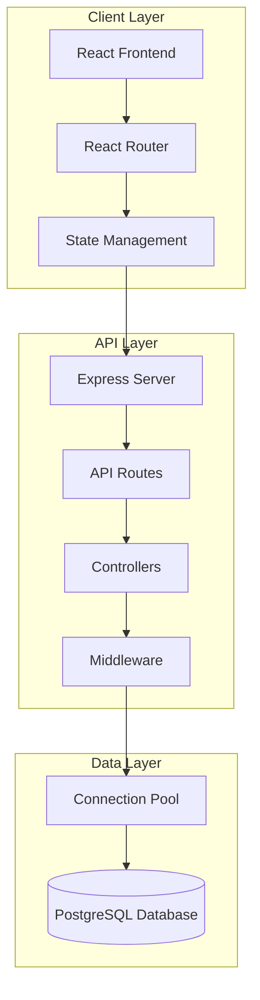

# Design Document: Fund Data Dashboard

## Overview

The Fund Data Dashboard is a full-stack web application that provides users with comprehensive access to US and Canada mutual fund and ETF data. The system follows a three-tier architecture with a React-based frontend, Node.js/Express REST API backend, and PostgreSQL database. The application emphasizes modern UI design, efficient data retrieval, and responsive user experience across all devices.

**Note:** This design provides a foundational structure and sample implementation patterns. The actual application will involve complex data queries with multiple table joins and sophisticated filtering logic based on your specific 10+ table schema. The examples shown here demonstrate the architectural patterns and best practices to follow as you build out the full feature set.

## Architecture

### High-Level Architecture



### Technology Stack

**Frontend:**
- React 18+ for UI components and state management
- Material-UI (MUI) v5 for component library and design system
- React Router v6 for client-side routing
- Axios for HTTP requests
- React Query for server state management and caching

**Backend:**
- Node.js (LTS version) as runtime environment
- Express.js v4 for REST API framework
- node-postgres (pg) for PostgreSQL client
- dotenv for environment configuration
- cors for cross-origin resource sharing
- helmet for security headers

**Database:**
- PostgreSQL 14+ for data storage
- Connection pooling via pg Pool

### Project Structure

```
fund-data-dashboard/
├── client/                          # React frontend
│   ├── public/
│   │   ├── index.html
│   │   └── favicon.ico
│   ├── src/
│   │   ├── components/              # React components
│   │   │   ├── FundList.jsx
│   │   │   ├── FundDetail.jsx
│   │   │   ├── CategoryPerformance.jsx
│   │   │   ├── SearchBar.jsx
│   │   │   ├── FilterPanel.jsx
│   │   │   ├── ErrorBoundary.jsx
│   │   │   └── ErrorDisplay.jsx
│   │   ├── hooks/                   # Custom React hooks
│   │   │   ├── useFunds.js
│   │   │   ├── useFundDetail.js
│   │   │   └── useCategoryPerformance.js
│   │   ├── services/                # API service layer
│   │   │   └── api.js
│   │   ├── utils/                   # Utility functions
│   │   │   ├── formatters.js
│   │   │   └── validators.js
│   │   ├── App.jsx                  # Root component
│   │   ├── index.jsx                # Entry point
│   │   └── theme.js                 # MUI theme configuration
│   ├── package.json
│   └── .env                         # Frontend environment variables
│
├── server/                          # Node.js backend
│   ├── config/
│   │   └── db.js                    # Database connection pool
│   ├── controllers/
│   │   ├── fundController.js
│   │   ├── categoryController.js
│   │   └── managerController.js
│   ├── routes/
│   │   ├── funds.js
│   │   ├── categories.js
│   │   └── managers.js
│   ├── middleware/
│   │   ├── errorHandler.js
│   │   ├── validator.js
│   │   └── logger.js
│   ├── utils/
│   │   ├── formatters.js
│   │   └── queryBuilder.js
│   ├── tests/                       # Backend tests
│   │   ├── unit/
│   │   │   ├── fundController.test.js
│   │   │   └── validators.test.js
│   │   └── integration/
│   │       └── api.test.js
│   ├── server.js                    # Express app entry point
│   ├── package.json
│   └── .env                         # Backend environment variables
│
├── .gitignore
├── README.md
└── package.json                     # Root package.json (optional monorepo setup)
```

**Key Structure Decisions:**

1. **Separate client/server directories**: Clear separation between frontend and backend code
2. **Component organization**: Flat structure for components (can add subdirectories if it grows)
3. **Custom hooks**: Encapsulate React Query logic for reusability
4. **Service layer**: Centralized API calls in `services/api.js`
5. **Database scripts**: Version-controlled migrations and seed data
6. **Test organization**: Separate unit and integration tests

### Design Rationale

**Material-UI Selection:** MUI provides comprehensive pre-built components following Material Design principles, excellent TypeScript support, built-in accessibility features, and responsive design capabilities. Research indicates MUI remains a popular choice in 2025 for data-intensive applications due to its robust data grid and table components.

**Node.js/Express Backend:** This combination offers lightweight REST API development, excellent PostgreSQL integration through node-postgres, and strong ecosystem support. Express provides flexibility for middleware integration and straightforward routing.

**Connection Pooling:** Using pg Pool maintains a reusable set of database connections, reducing overhead from repeatedly opening/closing connections. Research shows this can improve throughput by up to 50% and maintain response times under 100ms even under load.

## Components and Interfaces

### Frontend Components

#### 1. App Component
- Root component managing routing and global state
- Wraps application with MUI ThemeProvider
- Configures React Query client

#### 2. FundList Component
- Displays paginated table of all funds
- Implements search and filter functionality
- Columns: Name, Ticker, Type, Category, MER, Rank
- Props: `filters`, `onFilterChange`, `onFundSelect`

#### 3. FundDetail Component
- Shows comprehensive information for a single fund
- Sections: Basic Info, Fees, Manager Info, Performance
- Props: `fundId`

#### 4. CategoryPerformance Component
- Displays performance metrics grouped by category
- Visualizes returns using charts (1Y, 3Y, 5Y, YTD)
- Props: `categoryData`

#### 5. SearchBar Component
- Text input for searching funds by name, ticker, or manager
- Debounced input to reduce API calls
- Props: `onSearch`, `placeholder`

#### 6. FilterPanel Component
- Dropdown filters for fund type and category
- Props: `filters`, `onFilterChange`, `availableCategories`

#### 7. ErrorBoundary Component
- Catches and displays user-friendly error messages
- Provides retry functionality
- Props: `fallback`, `onReset`

### Backend Components

#### 1. Server (server.js)
- Initializes Express application
- Configures middleware (cors, helmet, express.json)
- Registers route handlers
- Starts HTTP server

#### 2. Database Connection (db.js)
- Creates and exports PostgreSQL connection pool
- Configuration: max 20 connections, idle timeout 30s
- Handles connection errors and retries

#### 3. Routes (routes/)
- `funds.js`: Fund-related endpoints
- `categories.js`: Category performance endpoints
- `managers.js`: Portfolio manager endpoints

#### 4. Controllers (controllers/)
- `fundController.js`: Business logic for fund operations
- `categoryController.js`: Category aggregation logic
- `managerController.js`: Manager data retrieval

#### 5. Middleware (middleware/)
- `errorHandler.js`: Centralized error handling
- `validator.js`: Request parameter validation
- `logger.js`: Request/response logging

### API Endpoints

**Sample endpoints demonstrating the pattern - actual implementation will include additional endpoints for complex queries:**

| Method | Endpoint | Description | Query Parameters |
|--------|----------|-------------|------------------|
| GET | `/api/funds` | Get all funds with pagination | `page`, `limit`, `search`, `type`, `category` |
| GET | `/api/funds/:id` | Get fund details by ID | - |
| GET | `/api/categories/performance` | Get category performance metrics | - |
| GET | `/api/funds/rankings/:category` | Get fund rankings within category | `category` |

*Additional endpoints will be added as needed for complex filtering and multi-table joins specific to your data model.*

### Request/Response Examples

**GET /api/funds?page=1&limit=20&type=ETF**

Response:
```json
{
  "data": [
    {
      "id": 1,
      "name": "Vanguard S&P 500 ETF",
      "ticker": "VOO",
      "type": "ETF",
      "category": "Large Cap Equity",
      "mer": 0.03,
      "rank": 5,
      "totalInCategory": 150
    }
  ],
  "pagination": {
    "page": 1,
    "limit": 20,
    "total": 500,
    "totalPages": 25
  }
}
```

**GET /api/funds/:id**

Response:
```json
{
  "id": 1,
  "name": "Vanguard S&P 500 ETF",
  "ticker": "VOO",
  "type": "ETF",
  "category": "Large Cap Equity",
  "inceptionDate": "2010-09-07",
  "nav": 425.50,
  "mer": 0.03,
  "frontLoad": 0.00,
  "backLoad": 0.00,
  "managers": [
    {
      "id": 10,
      "name": "John Smith",
      "tenure": 8.5
    }
  ],
  "performance": {
    "ytd": 12.5,
    "oneYear": 18.3,
    "threeYear": 45.2,
    "fiveYear": 85.7
  }
}
```

## Data Models

### Database Schema

**Note:** The schemas below are simplified examples to demonstrate the structure. Your actual PostgreSQL database with 10+ tables will have more complex relationships and fields. These examples show the pattern for how to define tables, indexes, and relationships.

#### Sample: funds Table
```sql
CREATE TABLE funds (
    id SERIAL PRIMARY KEY,
    name VARCHAR(255) NOT NULL,
    ticker VARCHAR(10) UNIQUE NOT NULL,
    type VARCHAR(20) NOT NULL CHECK (type IN ('Mutual Fund', 'ETF')),
    category_id INTEGER REFERENCES categories(id),
    inception_date DATE,
    nav DECIMAL(10, 2),
    created_at TIMESTAMP DEFAULT CURRENT_TIMESTAMP,
    updated_at TIMESTAMP DEFAULT CURRENT_TIMESTAMP
);

CREATE INDEX idx_funds_ticker ON funds(ticker);
CREATE INDEX idx_funds_category ON funds(category_id);
CREATE INDEX idx_funds_type ON funds(type);
```

#### Sample: categories Table
```sql
CREATE TABLE categories (
    id SERIAL PRIMARY KEY,
    name VARCHAR(100) UNIQUE NOT NULL,
    description TEXT
);
```

#### Sample: fees Table
```sql
CREATE TABLE fees (
    id SERIAL PRIMARY KEY,
    fund_id INTEGER REFERENCES funds(id) ON DELETE CASCADE,
    mer DECIMAL(5, 2),
    front_load DECIMAL(5, 2) DEFAULT 0.00,
    back_load DECIMAL(5, 2) DEFAULT 0.00,
    transaction_fee DECIMAL(5, 2) DEFAULT 0.00
);

CREATE INDEX idx_fees_fund ON fees(fund_id);
```

#### Sample: managers Table
```sql
CREATE TABLE managers (
    id SERIAL PRIMARY KEY,
    name VARCHAR(255) NOT NULL,
    bio TEXT,
    start_date DATE
);
```

#### Sample: fund_managers Table (Junction)
```sql
CREATE TABLE fund_managers (
    fund_id INTEGER REFERENCES funds(id) ON DELETE CASCADE,
    manager_id INTEGER REFERENCES managers(id) ON DELETE CASCADE,
    start_date DATE NOT NULL,
    PRIMARY KEY (fund_id, manager_id)
);

CREATE INDEX idx_fund_managers_fund ON fund_managers(fund_id);
CREATE INDEX idx_fund_managers_manager ON fund_managers(manager_id);
```

#### Sample: performance Table
```sql
CREATE TABLE performance (
    id SERIAL PRIMARY KEY,
    fund_id INTEGER REFERENCES funds(id) ON DELETE CASCADE,
    ytd DECIMAL(6, 2),
    one_year DECIMAL(6, 2),
    three_year DECIMAL(6, 2),
    five_year DECIMAL(6, 2),
    as_of_date DATE NOT NULL
);

CREATE INDEX idx_performance_fund ON performance(fund_id);
CREATE INDEX idx_performance_date ON performance(as_of_date);
```

#### Sample: rankings Table
```sql
CREATE TABLE rankings (
    id SERIAL PRIMARY KEY,
    fund_id INTEGER REFERENCES funds(id) ON DELETE CASCADE,
    category_id INTEGER REFERENCES categories(id),
    rank INTEGER NOT NULL,
    total_in_category INTEGER NOT NULL,
    as_of_date DATE NOT NULL,
    UNIQUE(fund_id, category_id, as_of_date)
);

CREATE INDEX idx_rankings_fund ON rankings(fund_id);
CREATE INDEX idx_rankings_category ON rankings(category_id);
```

**Your actual schema:** Map these patterns to your existing 10+ tables. The key principles are:
- Use appropriate indexes on foreign keys and frequently queried columns
- Use CASCADE for referential integrity
- Use appropriate data types and constraints

### Frontend Data Models (TypeScript Interfaces)

**Sample interfaces - adapt these to match your actual data structure:**

```typescript
interface Fund {
  id: number;
  name: string;
  ticker: string;
  type: 'Mutual Fund' | 'ETF';
  category: string;
  inceptionDate: string;
  nav: number;
  mer: number;
  frontLoad: number;
  backLoad: number;
  managers: Manager[];
  performance: Performance;
  rank?: number;
  totalInCategory?: number;
}

interface Manager {
  id: number;
  name: string;
  tenure: number;
}

interface Performance {
  ytd: number;
  oneYear: number;
  threeYear: number;
  fiveYear: number;
}

interface CategoryPerformance {
  categoryName: string;
  ytd: number;
  oneYear: number;
  threeYear: number;
  fiveYear: number;
  fundCount: number;
}

interface PaginatedResponse<T> {
  data: T[];
  pagination: {
    page: number;
    limit: number;
    total: number;
    totalPages: number;
  };
}
```

## Correctness Properties

*A property is a characteristic or behavior that should hold true across all valid executions of a system—essentially, a formal statement about what the system should do. Properties serve as the bridge between human-readable specifications and machine-verifiable correctness guarantees.*


### Property 1: Complete field rendering
*For any* fund object with populated fields, the rendered output should contain all required fields including name, ticker, type, inception date, NAV, MER, fee information, manager names, manager tenure, and performance metrics.
**Validates: Requirements 1.1, 1.2, 2.1, 2.2, 3.1, 3.3, 4.1, 4.2, 5.1, 5.2**

### Property 2: API response structure validity
*For any* valid fund ID, the API response should be valid JSON containing all required fields (id, name, ticker, type, category, mer, managers, performance) with correct data types.
**Validates: Requirements 1.4**

### Property 3: Numeric precision for fees
*For any* fee value returned by the API, the value should be formatted with exactly two decimal places.
**Validates: Requirements 2.3**

### Property 4: Multiple managers display
*For any* fund with N managers (where N > 0), the rendered output should contain all N manager names.
**Validates: Requirements 3.2**

### Property 5: Category performance aggregation
*For any* category with a set of funds, the calculated average return should equal the sum of all fund returns divided by the count of funds in that category.
**Validates: Requirements 4.3**

### Property 6: Performance metric formatting
*For any* performance metric (YTD, 1Y, 3Y, 5Y), the displayed value should be formatted as a percentage with exactly two decimal places.
**Validates: Requirements 4.4**

### Property 7: Ranking sort order
*For any* list of funds sorted by rank, each fund's rank value should be less than or equal to the next fund's rank value (ascending order).
**Validates: Requirements 5.3**

### Property 8: Search term matching
*For any* search term and search results, every returned fund should contain the search term in at least one of these fields: name, ticker, or manager name (case-insensitive).
**Validates: Requirements 6.1**

### Property 9: Filter correctness
*For any* applied filter (type or category) and filter value, all returned funds should have that exact value for the filtered attribute.
**Validates: Requirements 6.2, 6.3**

### Property 10: Pagination correctness
*For any* page number P and limit L, the API should return exactly L items (or fewer if on the last page), and the items should correspond to the slice from index (P-1)*L to P*L of the complete dataset.
**Validates: Requirements 8.1**

### Property 11: Error response structure
*For any* error condition, the API response should include an appropriate HTTP status code (400, 404, 500, 503) and a non-empty error message field.
**Validates: Requirements 8.5**

### Property 12: SQL injection prevention
*For any* input string containing SQL special characters (quotes, semicolons, comments), the query should treat the input as literal data and not execute any injected SQL commands.
**Validates: Requirements 9.2**

### Property 13: Invalid parameter handling
*For any* invalid query parameter (wrong type, out of range, malformed), the API should return a 400 status code with validation error details.
**Validates: Requirements 10.2**

### Property 14: User-friendly error messages
*For any* error response from the API, the frontend-displayed error message should not contain technical details such as stack traces, database errors, or file paths.
**Validates: Requirements 10.4**

### Property 15: Error UI actions
*For any* error state in the frontend, the error UI should include both a retry action and a navigation action (back/home).
**Validates: Requirements 10.5**

## Error Handling

### Backend Error Handling

**Database Connection Errors:**
- Catch connection pool errors during initialization
- Return 503 Service Unavailable with message: "Database temporarily unavailable"
- Log detailed error for debugging

**Query Errors:**
- Catch SQL errors during query execution
- Return 500 Internal Server Error for unexpected errors
- Return 400 Bad Request for constraint violations
- Log query and parameters for debugging

**Validation Errors:**
- Validate all input parameters before database queries
- Return 400 Bad Request with specific validation messages
- Example: "Invalid page number: must be a positive integer"

**Not Found Errors:**
- Return 404 Not Found when resource doesn't exist
- Include helpful message: "Fund with ID {id} not found"

**Centralized Error Handler:**
```javascript
app.use((err, req, res, next) => {
  console.error(err.stack);
  
  const statusCode = err.statusCode || 500;
  const message = err.message || 'Internal server error';
  
  res.status(statusCode).json({
    error: {
      message: message,
      status: statusCode,
      timestamp: new Date().toISOString()
    }
  });
});
```

### Frontend Error Handling

**API Request Errors:**
- Use React Query's error handling capabilities
- Display toast notifications for transient errors
- Show error boundary for critical errors

**Network Errors:**
- Detect offline status
- Display "No internet connection" message
- Provide retry button

**Validation Errors:**
- Display inline validation messages for form inputs
- Highlight invalid fields in red
- Prevent form submission until valid

**Error Boundary:**
```typescript
class ErrorBoundary extends React.Component {
  state = { hasError: false, error: null };
  
  static getDerivedStateFromError(error) {
    return { hasError: true, error };
  }
  
  render() {
    if (this.state.hasError) {
      return (
        <ErrorDisplay 
          message="Something went wrong"
          onRetry={() => this.setState({ hasError: false })}
          onHome={() => window.location.href = '/'}
        />
      );
    }
    return this.props.children;
  }
}
```

## Testing Strategy

### Unit Testing

**Backend Unit Tests:**
- Test individual controller functions with mocked database
- Test validation middleware with various input combinations
- Test error handler with different error types
- Test utility functions (formatting, calculations)
- Framework: Jest with supertest for API testing

**Frontend Unit Tests:**
- Test individual components with mocked props
- Test utility functions (formatters, validators)
- Test custom hooks with React Testing Library
- Framework: Jest with React Testing Library

**Example Unit Tests:**
- Test that FundDetail component renders with valid fund data
- Test that formatPercentage function returns "12.34%" for input 12.3456
- Test that validatePageNumber rejects negative numbers
- Test that error handler returns 404 for missing resources

### Property-Based Testing

**Configuration:**
- Use fast-check library for JavaScript/TypeScript property-based testing
- Configure each property test to run minimum 100 iterations
- Tag each test with feature name and property number

**Backend Property Tests:**
- Property 2: API response structure validity
- Property 3: Numeric precision for fees
- Property 5: Category performance aggregation
- Property 7: Ranking sort order
- Property 9: Filter correctness
- Property 10: Pagination correctness
- Property 11: Error response structure
- Property 12: SQL injection prevention
- Property 13: Invalid parameter handling

**Frontend Property Tests:**
- Property 1: Complete field rendering
- Property 4: Multiple managers display
- Property 6: Performance metric formatting
- Property 8: Search term matching
- Property 14: User-friendly error messages
- Property 15: Error UI actions

**Test Tag Format:**
```javascript
// Feature: fund-data-dashboard, Property 2: API response structure validity
test('API returns valid JSON with all required fields for any fund ID', async () => {
  await fc.assert(
    fc.asyncProperty(fc.integer({ min: 1, max: 1000 }), async (fundId) => {
      const response = await request(app).get(`/api/funds/${fundId}`);
      expect(response.body).toHaveProperty('id');
      expect(response.body).toHaveProperty('name');
      expect(response.body).toHaveProperty('ticker');
      // ... validate all required fields
    }),
    { numRuns: 100 }
  );
});
```

### Integration Testing

**API Integration Tests:**
- Test complete request/response cycles with real database
- Use test database with known seed data
- Test authentication and authorization flows
- Test error scenarios (invalid inputs, missing resources)

**End-to-End Tests:**
- Test critical user flows (search, filter, view details)
- Use Cypress or Playwright for browser automation
- Test responsive behavior on different screen sizes
- Test error recovery (retry, navigation)

### Test Data Generation

**Property Test Generators:**
- Generate random fund objects with valid structure
- Generate random search terms (alphanumeric, special chars)
- Generate random filter combinations
- Generate edge cases (empty strings, null values, boundary values)
- Generate malicious inputs (SQL injection attempts, XSS)

**Example Generator:**
```javascript
const fundGenerator = fc.record({
  id: fc.integer({ min: 1 }),
  name: fc.string({ minLength: 1, maxLength: 255 }),
  ticker: fc.string({ minLength: 1, maxLength: 10 }),
  type: fc.constantFrom('Mutual Fund', 'ETF'),
  mer: fc.float({ min: 0, max: 5, noNaN: true }),
  managers: fc.array(managerGenerator, { minLength: 1, maxLength: 5 })
});
```

### Testing Best Practices

**Balance:**
- Use unit tests for specific examples and edge cases
- Use property tests for universal correctness across many inputs
- Both approaches are complementary and necessary

**Coverage Goals:**
- Aim for 80%+ code coverage on backend
- Focus on critical paths and business logic
- Don't over-test trivial code (getters, setters)

**Test Maintenance:**
- Keep tests simple and readable
- Avoid testing implementation details
- Update tests when requirements change
- Remove obsolete tests promptly
